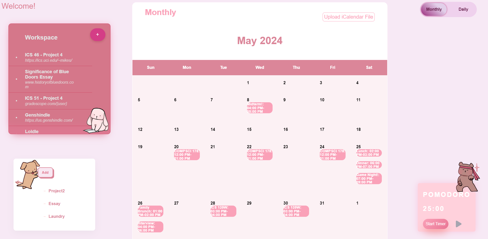

<h1>PomoPlanner</h1>

## Hello, welcome to our Venus Hacks 2024 Project!

PomoPlanner is a website that helps organize your workspace and schedule using the Pomodoro technique! The Pomodoro technique is a time management method that uses a 25/5-minute work/rest ratio, helping people stay focused and engaged with their work. Its structured approach and forgiving breaks keep the mind fresh while still maintaining productivity!

  
  

PomoPlanner provides a Pomodoro timer, a workspace to list assignments/resources, a task-list to keep track of deadlines and a calendar view of upcoming events. Users can import their own calendars and view the events of the day, or even look ahead in our month view. Whether you're a student, professional, or anyone looking to enhance productivity, this tool is tailored to meet your needs!
